# 深度学习实战  
## 实践一：BP神经网络的numpy实现  
任务文件夹 numpy_halfmoon  
### 网络参数：  
```Bash
epoch 5000
隐藏层神经元个数 10
learning_rate 0.1
正则化比例λ 0.001
```  
### 运行结果
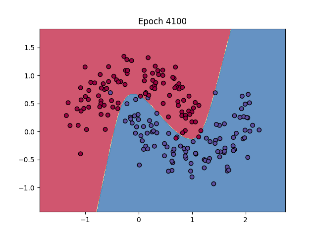
## 实践二：基于numpy实现BP神经网络的mnist图像分类  
任务文件夹 numpy_MNIST  
### 网络参数：  
```Bash  
epoch 400
隐藏层神经元个数 1024
learning_rate 0.2
decay_rate 0.98
正则化比例λ 0.01
激活函数_relu
损失函数 svm_loss
使用余弦退火+warmup
```
### 运行结果
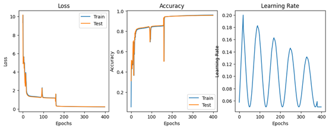
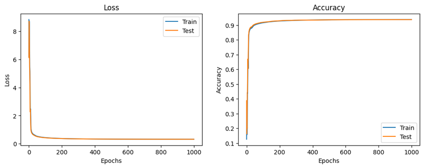
```bash
result:  
Epoch 399: Loss = 0.2081
Accuracy = 0.9603
Test loss = 0.2226
Test accuracy = 0.9568
``` 
### 尝试过程  
- 损失函数：  尝试使用交叉熵损失，mse损失，svm损失。其中svm损失效果最好。    
- 激活函数：  尝试使用sigmoid，relu。relu收敛速度极快，训练速度快，效果最好。  
- 学习率：    过大模型无法收敛，过小收敛速度较慢，且出现“涌现现象”，即在训练一些epoch后loss突然大幅度下降。  
- decay：     学习率衰减影响不大。  
- 正则化：    使用过大正则化会导致模型无法收敛至最优。  
- hidden neuron size:     过大无明显提升且训练速度大幅度下降，过小最优点效果不佳。
## 实践三：基于pytorch的mnist图像分类  
任务文件夹 pytorch_MNIST  
### 运行结果
| 模型 | Epoch | Loss | Accuracy |
| --- | --- | --- | --- |
| LeNet | 10 | 0.0011 | 99.17% |
| VGG | 10 | 0.0261 | 98.57% |
| ResNet-18 | 10 | 0.0128 | 99.42% |
| ViT (not-full converge) | 50 | - | 97.14% |
| ViT (without sqrt(d)) | 50 | - | 97.15% |

LeNet:
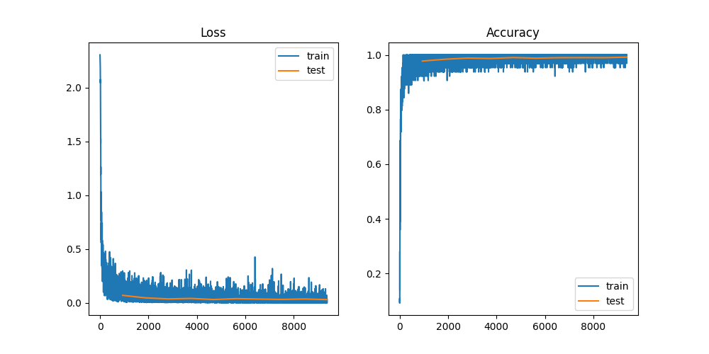
VGG:
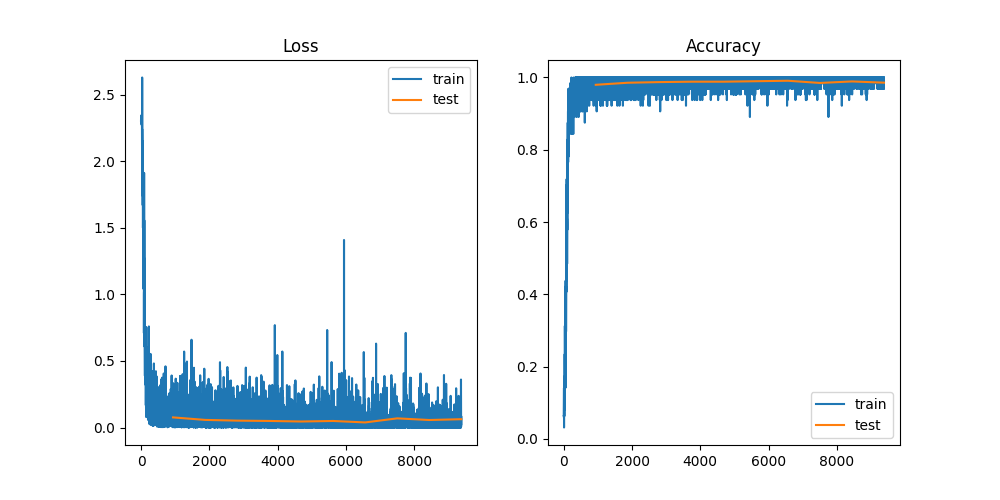
ResNet-18:
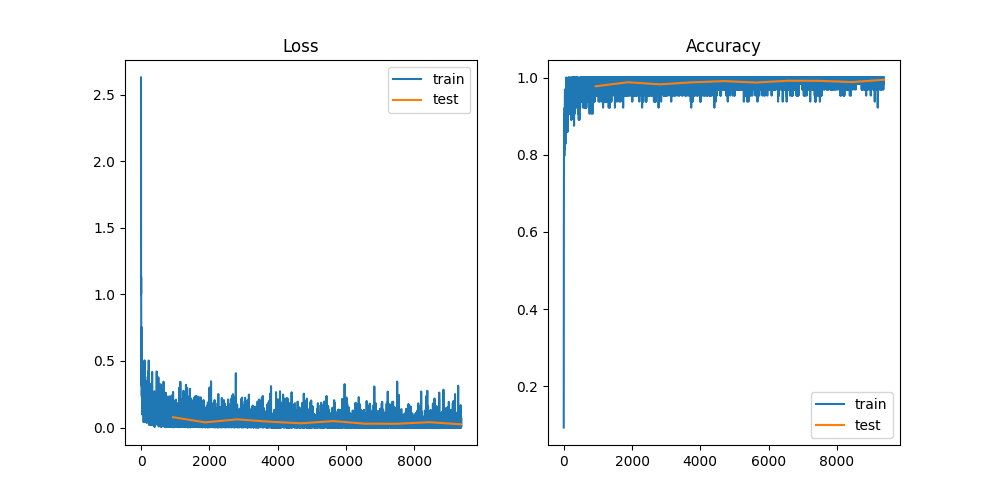
ViT:
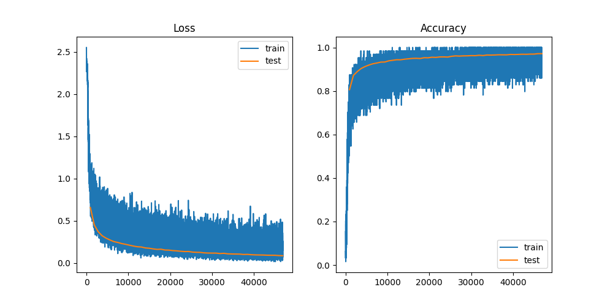


### 模型特点对比

| 模型 | 特点 | 优点 | 缺点 |
| --- | --- | --- | --- |
| LeNet | 经典的浅层卷积神经网络，包含少量卷积层和全连接层。 | 结构简单，适合小规模数据集，计算速度快 | 表达能力有限，难以处理更复杂的图像任务 |
| VGG-11 | 深层卷积网络，采用多个 3x3 卷积核堆叠，配合池化层提高特征提取效果。 | 较强的特征表达能力，适合较大规模图像分类任务 | 参数量大，计算资源消耗较高 |
| ResNet-18 | 采用残差结构，避免了深度增加带来的梯度消失问题，使深层网络的训练变得稳定。 | 深层结构表达能力强，适合复杂数据集，收敛速度快 | 对小数据集有时可能会过拟合，计算量相对较大 |

### ViT  
训练参数：  
```bash
lr: 5e-5  
optimizer: Adam  
Loss: NLLLoss  
activation: GELU(避免relu使得模型有效神经元过少)  
emb_size: 128  
attention_head: 8  
layer_num: 1  
```
训练时明显观查到训练前期需要预热，在0.5个epoch后Acc开始迅速增加，并在10个epoch后趋于平稳。  
如果使用PyTorch自带的Transformer层，需要注意添加参数batch_first=True,才能正确计算。
> 实验
- 为什么Transformer公式中要除以sqrt(d)?  
在网上查找的结果基本上都是从QK内积方差归一化的角度说明的，即认为除以sqrt(d)后可使得内积更均匀，避免训练中收敛慢/不收敛等情形。**但在实际测试时发现去掉这一部分后对实验结果几乎没有影响（无论是收敛速度还是bestAccuracy）**，可能是因为MNIST任务太过简单。  

## 实践四：Tiny-VOC 图像分类  
任务文件夹 VOC 
### 训练前处理  
使用脚本将分割类数据标注转为分类数据标注，并将不同尺寸的训练图片转为224x224 PNG格式。  
数据样式如下：  
```Bash
00000,0,1
00001,4
00002,1
#index,class0,class1,...
```
经过统计发现Tiny-VOC提供数据集只有**五**个类别（而非PPT中所说20个）：  
car,plane,cat,people,bird 

### 数据预处理  
经过实测发现网络很容易产生过拟合现象，所以采用数据增强，BatchNorm，Dropout等手段增强网络泛化能力。~~由于没有足够的算力，无法进行超参数搜索。~~

### 训练  
对非ViT架构模型采用统一学习率与优化器。  
```
lr: 1e-3 (ViT: 5e-5) 
optimizer: Adam  
Epoch: Unfixed (Train until converge)  
```
网络参数量及训练情况如下：  

| Model     | Parameters | TestAcc | Precision | Recall | F1     |  
|-----------|------------|---------|-----------|--------|--------|  
| LeNet     | 21M        | 0.8906  | 0.7703    | 0.7454 | 0.7577 |  
| VGG       | 432M       | 0.8828  | 0.7716    | 0.7386 | 0.7547 |  
| **Res18** | 43M        | 0.9153  | 0.8512    | 0.8114 | 0.8308 |  
| ViT       | 83M/169M   | 0.8525  | 0.7141    | 0.6878 | 0.7007 |  

实际上，ViT模型即使经过反复修改我也无法使模型收敛到一个比较良好的表现😂推测有以下原因：
1. 数据集规模较小，无法充分训练。
2. ViT需要训练较多epoch才能开始收敛。
3. ViT对超参数设置较为敏感。
4. 需要较大的模型架构  

由于算力问题只能暂时搁置。
### PR-Curve  
可以看出其实只有ResNet18的PR曲线表现尚可。这些模型可能都还远未收敛至最优。
LeNet:
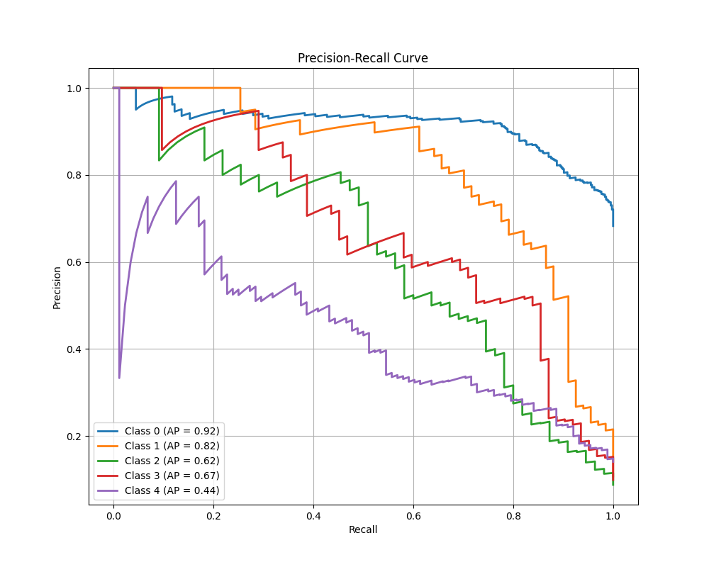  
VGG:
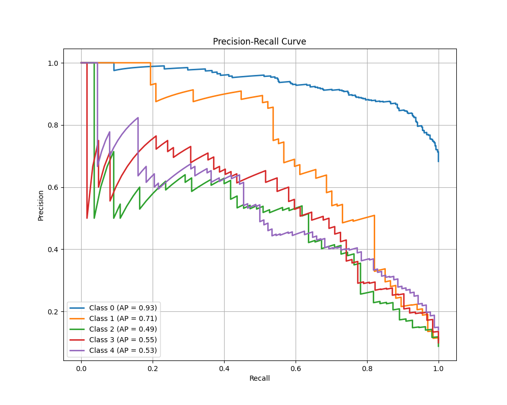
ResNet18:
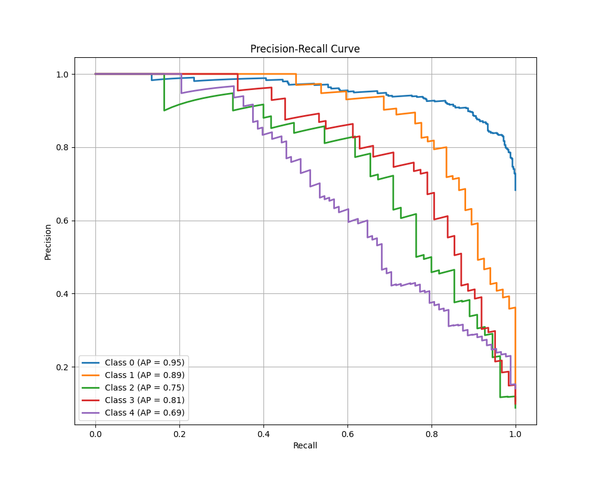
ViT:
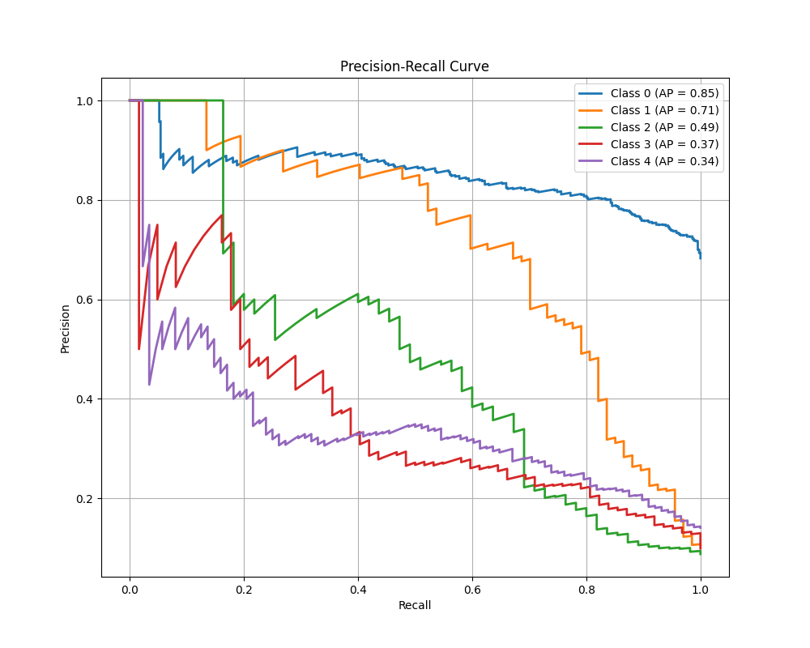
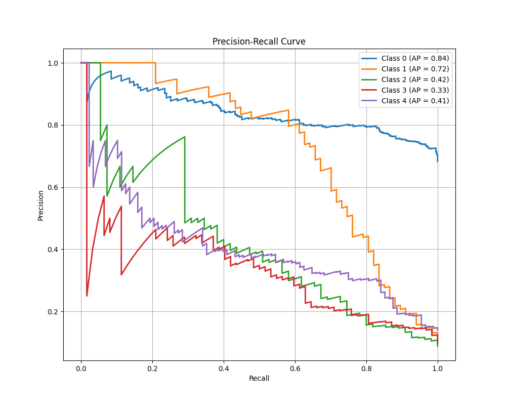


### 结论
在Tiny-VOC数据集上，传统卷积神经网络（ResNet）表现~~可能~~优于ViT模型。  
### 一些发现  
- 在面对过拟合情形时，可以选择增强模型泛化能力或降低模型拟合能力。实际上在网上搜索中了解到，大部分都建议增强泛化能力而非有意减小模型架构。其实在训练过程中也有所体会。大模型可能在最初会产生过拟合的问题，但很多时候在坚持反复训练后testLoss也会突然下降，即模型泛化能力增强。  
- ResNet 和 ViT 模型在训练时Loss时常出现振荡现象，推测可能是学习率问题。  

## 一个实验 
任务文件夹 visualize_halfmoon
### 激活函数与非线性性 
心血来潮想到relu+MLP=分段线性函数，想要可视化考察一下不同激活函数对神经网络的非线性表达能力有何影响。 
### 尝试环境 
- pytorch  
- halfmoon数据集
- MLP 2->10->10->1 固定架构  
- AdamW优化器 
### 尝试组合 
成功拟合： 
- abs x abs 
- exp x exp 
- exp x cos 
- sin x sin 
- x^2  
- relu 
- sigmoid 
- sort 
- permute   

无法拟合： 
- *1/x* x *1/x*
- *tan* x *tan*
- *sgn* 
### 尝试结果
abs x abs

exp x exp

exp x cos

sin x sin

permute

sort

x^2

relu

sigmoid

### 结论  
令我比较惊讶的是对上一层输入的**排序**也能带来非线性性，根据上一层输入的大小关系的**permute**也可收敛。   
```Python
# sort
def forward(self, x):
    x = self.fc1(x)
    x, _ = torch.sort(x,dim=-1)
    x = self.fc2(x)
    x = self.fc3(x)
    return x
```
```Python
# permute
def forward(self, x):
    x = self.fc1(x)
    _, indices = torch.sort(x,dim=-1)
    x = torch.gather(self.fc2(x), dim=-1, index=indices)
    x = self.fc3(x)
    return x
```
据此我觉得激活函数主要决定网络的泛化方向，而对训练数据的拟合能力主要来自于反向传播算法（当然激活函数的性态不能太差劲）。不知道有没有这方面的文章😂 
