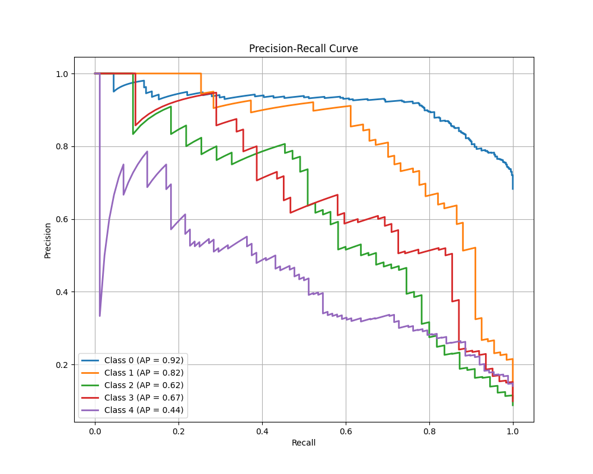
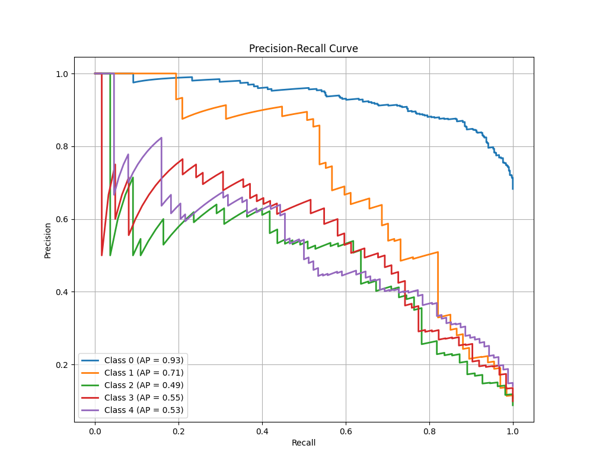
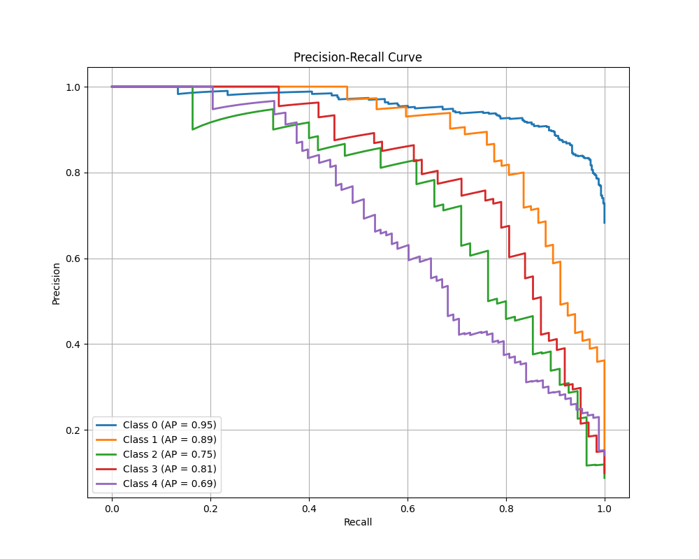
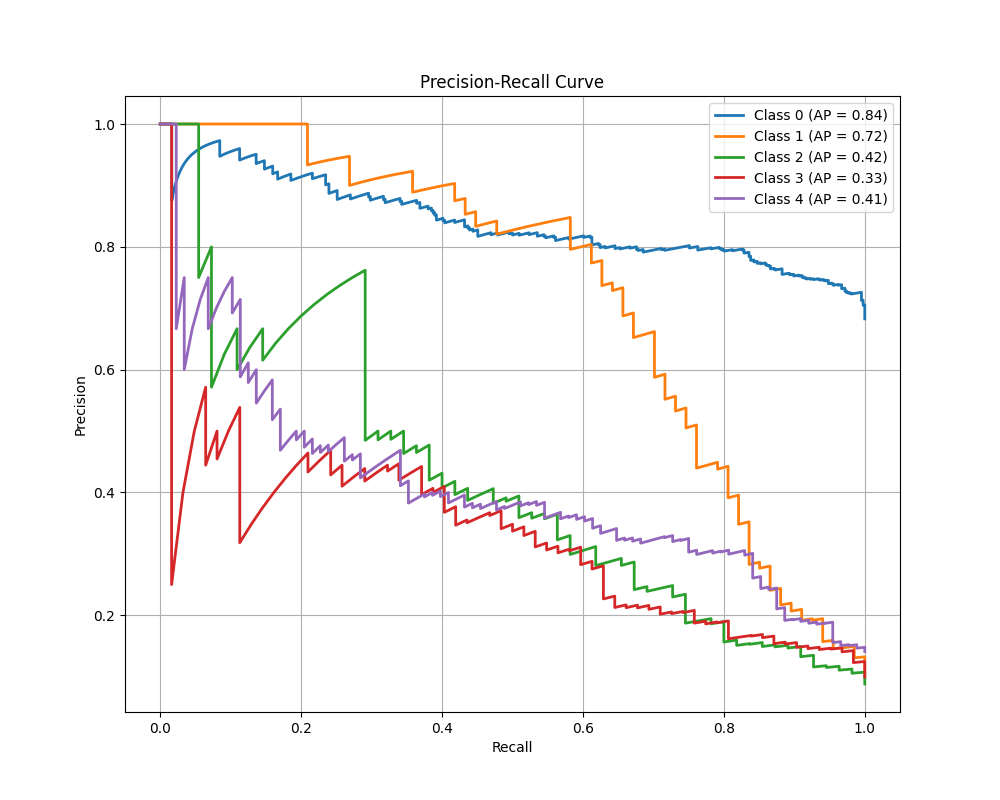

# Tiny-VOC
## 训练前处理  
使用脚本将分割类数据标注转为分类数据标注，并将不同尺寸的训练图片转为224x224 PNG格式。  
数据样式如下：  
```Bash
00000,0,1
00001,4
00002,1
#index,class0,class1,...
```
经过统计发现Tiny-VOC提供数据集只有**五**个类别（而非PPT中所说20个）：  
car,plane,cat,people,bird 

## 数据预处理  
经过实测发现网络很容易产生过拟合现象，所以采用数据增强，BatchNorm，Dropout等手段增强网络泛化能力。~~由于没有足够的算力，无法进行超参数搜索。~~

## 训练  
对非ViT架构模型采用统一学习率与优化器。  
```
lr: 1e-3 (ViT: 5e-5) 
optimizer: Adam  
Epoch: Unfixed (Train until converge)  
```
网络参数量及训练情况如下：  
| Model   | Parameters | TestAcc | Precision | Recall | F1 |  
|---------|------------|---------|-----------|--------|----|  
| LeNet   | 21M        | 0.8906  | 0.7703    | 0.7454 | 0.7577 |  
| VGG     | 432M       | 0.8828  | 0.7716    | 0.7386 | 0.7547 |  
|**Res18**| 43M        | 0.9153  | 0.8512    | 0.8114 | 0.8308 |  
| ViT     | 83M/169M   | 0.8525  | 0.7141    | 0.6878 | 0.7007 |  

实际上，ViT模型即使经过反复修改我也无法使模型正常工作😂推测有以下原因：
1. 数据集规模较小，无法充分训练。
2. ViT需要训练较多epoch才能开始收敛。
3. ViT对超参数设置较为敏感。
4. **ScalingLaw** (需要较大的模型架构)  

由于算力问题只能暂时搁置。
## PR-Curve  
可以看出其实只有ResNet18的PR曲线表现尚可。这些模型可能都还远未收敛至最优。
LeNet:
  
VGG:

ResNet18:

ViT:




## 结论
在Tiny-VOC数据集上，传统卷积神经网络（ResNet）表现~~可能~~优于ViT模型。  
## 一些发现  
- 在面对过拟合情形时，可以选择增强模型泛化能力或降低模型拟合能力。实际上在网上搜索中了解到，大部分都建议增强泛化能力而非有意减小模型架构。其实在训练过程中也有所体会。大模型可能在最初会产生过拟合的问题，但很多时候在坚持反复训练后testLoss也会突然下降，即模型泛化能力增强。  
- ResNet 和 ViT 模型在训练时Loss时常出现振荡现象，推测可能是学习率问题。  


