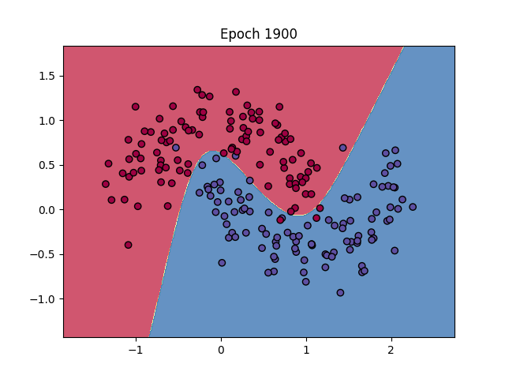
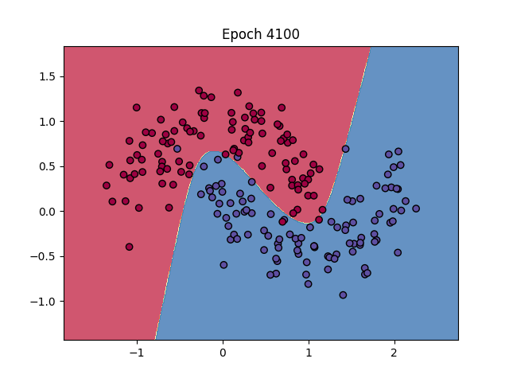

# 实践一
## 网络参数
epoch 5000  
隐藏层神经元个数 10  
learning rate 0.1  
正则化比例λ 0.001
## 运行结果
由程序生成epoch100~5000的决策边界动态结果(类似http://playground.tensorflow.org/的可视化)。下图可以看出模型较好的进行了二分类。
 
 

 
## 程序源码  
```Python
import numpy as np
import matplotlib.pyplot as plt
from sklearn.datasets import make_moons

def initialize_parameters(n_input, n_hidden, n_output):
    np.random.seed(0)
    W1 = np.random.randn(n_input, n_hidden) * 1
    b1 = np.zeros((1, n_hidden))
    W2 = np.random.randn(n_hidden, n_output) * 1
    b2 = np.zeros((1, n_output))
    return W1, b1, W2, b2

def forward_propagation(X, W1, b1, W2, b2):
    z1 = np.dot(X, W1) + b1
    a1 = np.tanh(z1)
    z2 = np.dot(a1, W2) + b2
    exp_scores = np.exp(z2 - np.max(z2, axis=1, keepdims=True)) 
    probs = exp_scores / np.sum(exp_scores, axis=1, keepdims=True)  
    return z1, a1, z2, probs

def compute_loss(probs, y, W1, W2, reg_lambda):
    m = y.shape[0]
    correct_logprobs = -np.log(probs[range(m), y])
    data_loss = np.sum(correct_logprobs) / m
    # 正则化项
    reg_loss = 0.5 * reg_lambda * (np.sum(np.square(W1)) + np.sum(np.square(W2)))
    return data_loss + reg_loss

def backpropagation(X, y, z1, a1, probs, W1, W2, b1, b2, reg_lambda, epsilon):
    m = X.shape[0]
    
    # 反向传播
    delta3 = probs
    delta3[range(m), y] -= 1
    delta3 /= m
    
    dW2 = np.dot(a1.T, delta3) + reg_lambda * W2  # 正则化
    db2 = np.sum(delta3, axis=0, keepdims=True)
    
    delta2 = np.dot(delta3, W2.T) * (1 - np.power(a1, 2))  # tanh导数
    
    dW1 = np.dot(X.T, delta2) + reg_lambda * W1  # 正则化
    db1 = np.sum(delta2, axis=0, keepdims=True)
    
    # 梯度下降参数更新
    W1 += -epsilon * dW1
    b1 += -epsilon * db1
    W2 += -epsilon * dW2
    b2 += -epsilon * db2
    
    return W1, b1, W2, b2

def predict(X, W1, b1, W2, b2):
    _, _, _, probs = forward_propagation(X, W1, b1, W2, b2)
    return np.argmax(probs, axis=1)

#可视化决策边界
def plot_decision_boundary(X, y, W1, b1, W2, b2, iteration):
    x_min, x_max = X[:, 0].min() - 0.5, X[:, 0].max() + 0.5
    y_min, y_max = X[:, 1].min() - 0.5, X[:, 1].max() + 0.5
    h = 0.01  # 网格步长
    xx, yy = np.meshgrid(np.arange(x_min, x_max, h), np.arange(y_min, y_max, h))
    Z = predict(np.c_[xx.ravel(), yy.ravel()], W1, b1, W2, b2)
    Z = Z.reshape(xx.shape)
    
    plt.clf()  # 清除当前绘图
    plt.contourf(xx, yy, Z, alpha=0.8, cmap=plt.cm.Spectral)
    plt.scatter(X[:, 0], X[:, 1], c=y, edgecolors='k', cmap=plt.cm.Spectral)
    plt.title(f"Epoch {iteration}")
    plt.pause(0.01)  # 暂停以更新图像

def train(X, y, num_epochs, n_hidden, epsilon, reg_lambda):
    n_input = X.shape[1]
    n_output = np.max(y) + 1  # 类别数
    
    # 初始化参数
    W1, b1, W2, b2 = initialize_parameters(n_input, n_hidden, n_output)
    
    plt.ion()  # 打开交互模式
    fig = plt.figure()
    
    for i in range(num_epochs):
        # 前向传播
        z1, a1, z2, probs = forward_propagation(X, W1, b1, W2, b2)
        
        # 计算损失
        loss = compute_loss(probs, y, W1, W2, reg_lambda)
        
        # 每隔一定迭代次数打印损失并更新可视化
        if i % 100 == 99:
            print(f"Iteration {i+1}, loss: {loss}")
            plot_decision_boundary(X, y, W1, b1, W2, b2, i+1)
        
        # 反向传播并更新参数
        W1, b1, W2, b2 = backpropagation(X, y, z1, a1, probs, W1, W2, b1, b2, reg_lambda, epsilon)
    
    plt.ioff() 
    plt.show() 
    return W1, b1, W2, b2

if __name__ == "__main__":
    np.random.seed(0)
    
    # 生成数据集
    X, y = make_moons(n_samples=200, noise=0.2)
    
    W1, b1, W2, b2 = train(X, y, num_epochs=5000, n_hidden=10, epsilon=0.1, reg_lambda=0.001)
```
