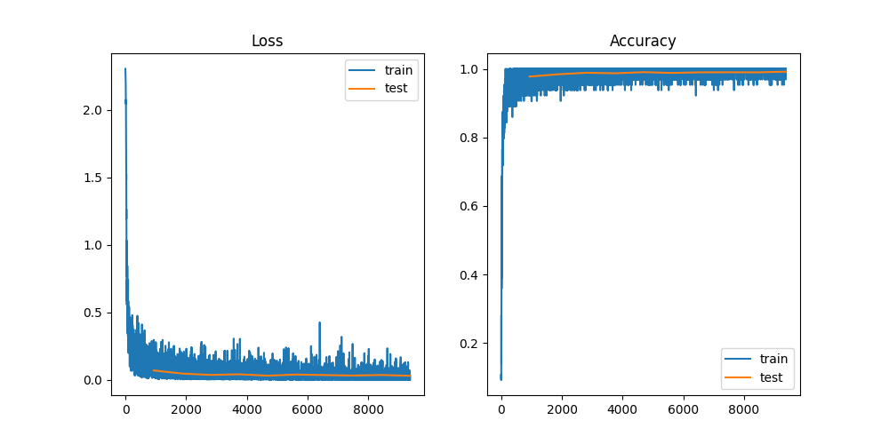

## 运行结果  
LeNet:  

Epoch 10, Loss: 0.0010677636601030827
Accuracy: 99.17%

VGG:

Epoch 10, Loss: 0.026146724820137024
Accuracy: 98.57%

ResNet-18:

Epoch 10, Loss: 0.012827949598431587
Accuracy: 99.42%

ViT:
  
Epoch 50, Accuracy: 97.14%(应该还没有完全收敛)  
(仅使用了128 embed 8 head 1 layer Transformer，规模极小)  

Epoch 50, Accuracy: 97.15%  
去掉Transformer中除以sqrt(d)部分进行尝试，对训练几乎没有影响。  

## 模型特点对比

| 模型 | 特点 | 优点 | 缺点 |
| --- | --- | --- | --- |
| LeNet | 经典的浅层卷积神经网络，包含少量卷积层和全连接层。 | 结构简单，适合小规模数据集，计算速度快 | 表达能力有限，难以处理更复杂的图像任务 |
| VGG-11 | 深层卷积网络，采用多个 3x3 卷积核堆叠，配合池化层提高特征提取效果。 | 较强的特征表达能力，适合较大规模图像分类任务 | 参数量大，计算资源消耗较高 |
| ResNet-18 | 采用残差结构，避免了深度增加带来的梯度消失问题，使深层网络的训练变得稳定。 | 深层结构表达能力强，适合复杂数据集，收敛速度快 | 对小数据集有时可能会过拟合，计算量相对较大 |

## ViT  
训练参数：  
lr: 5e-5  
optimizer: Adam  
Loss: NLLLoss  
activation: GELU(避免relu使得模型有效神经元过少)  
emb_size: 128  
attention_head: 8  
layer_num: 1  
训练时明显观查到训练前期需要预热，在0.5个epoch后Acc开始迅速增加，并在10个epoch后趋于平稳。  
如果使用PyTorch自带的Transformer层，需要注意添加参数batch_first=True,才能正确计算。
> 实验
- 为什么Transformer公式中要除以sqrt(d)?  
在网上查找的结果基本上都是从QK内积方差归一化的角度说明的，即认为除以sqrt(d)后可使得内积更均匀，避免训练中收敛慢/不收敛等情形。**但在实际测试时发现去掉这一部分后对实验结果几乎没有影响（无论是收敛速度还是bestAccuracy）**，可能是因为MNIST任务太过简单。  